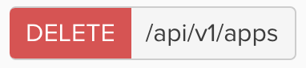
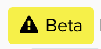

[][doc]

[][devforum] [](https://travis-ci.org/okta/okta.github.io)

# Okta Developer Site

The [Okta developer site][doc] serves Okta's API documentation and guides, including:
- [API references](https://developer.okta.com/docs/api/resources/)
- [SDK references and sample code](https://developer.okta.com/documentation/)
- [Authentication quickstarts](https://developer.okta.com/quickstart/)
- [Developer Blog](https://developer.okta.com/blog/) (not published from this repo, see [https://github.com/okta/okta.github.io](okta/okta.github.io))

If you have questions or need help with Okta's APIs or SDKs, visit the **[Developer Forum][devforum]**. You can also email developers@okta.com to create a support ticket.

## Contributing
The [Okta developer site][doc] is using [VuePress][vuepress] site generator. This allows the use of only yarn to install and build the site locally.
There are currently 2 parts to the site, the content and the themeing/plugins.

### Requirements
 - Node: 10.9+
 - Yarn: 1.9.4+

### Installing the site.
 - Clone this repository (or fork if you aren't a core contributor):

 ```sh
 git clone https://github.com/okta/okta-developer-docs
 ```

- Install the dependencie with `yarn`:
```sh
yarn install
```

This will install all the modules you need for the site to run on your machine

### Viewing the Site Locally
Once you have the site cloned to your machine and installed, you will have to run the development environment for you to view the site.

 - Open Terminal and change directories into your cloned repo
 - Issue the `yarn dev` command
 - Once the command is done running, you can visit http://localhost:8080/documentation/ in your web browser to view the site.
 > Note: if you try to visit the root, you will get a 404 page.  You must visit a sub-path.

## Adding and Updating Content
As an example, lets say you want to edit the `Okta Angular Sign-in Widget` code page. The URL of this page is `/code/angular/okta_angular_sign-in_widget/`.
To edit this page, you would navigate to `/packages/docs/code/angular/okta_angular_sign-in_widget/index.md` to edit the content of this page.

The directory structure from the `/packages/docs` folder relates directly to the URL you want to show. The `index.md` file that lives in the last folder in the sture will be rendered.
If you name the file anything other than `index.md`, it will be required that you also include `.html` to the url when you go to view the page in the browser

Part of the power that the VuePress development server gives us is live reloading of the content. When you make any changes to the markdown of the file, you will see the changes on the browser within seconds.
However, if you make any chnages to the frontmatter of the page, you may have to restart the development server.

## Testing Locally
Running the tests before committing should be done and can be accomplished by running `yarn test` from the terminal. This will run a series of tests to make sure that everything is working as expected and that your changes did not affect anything that was not planned.

### Where do Pictures and Assets go?
All images and other assets will live in the folder `/docs/.vuepress/public/assets` and should be referenced as such.

### Using Components in Markdown
There are a few different components that can be used inside of the markdown files to render some design specific html

#### Api Operations
The Api Operations component is used to render the html for defining an operation in our API reference

In the markdown, you can add
```html
<ApiOperation method="delete" url="/api/v1/apps" />
```
and this would render as:



Method value is used in the class to determine the background color.

get => $islamic-green (Green)

post => $sea-buckthorn (Orange)

put => $cerulean-5 (Blue)

delete => $valencia (Red)

#### Api Lifecycle
The API Lifecycle tag allows you to mark items as beta, ea, or deprecated.

In the markdown, you can add
```html
<ApiLifecycle access="beta" />
```
and this would render as:



#### Category Links
If you need to include a list of links for a category group which was defined in the frontmatter, you can use the `CategoryLinks` component.

As long as you have the category defined in your markdowns frontmatter such as:

```
---
category: myCategory
---
```

You can then use the category links component:

```html
<CategoryLinks category="myCategory" />
```

A few options are provided for you to allow for some customization

| Property    | Description                                                                                   |
|-------------|-----------------------------------------------------------------------------------------------|
| category    | The category you want to display for the links. This is based on your markdown frontmatter    |
| linkPrefix  | [ADVANCED] This property allows you to include links based on the path, instead of a category |
| sort        | Allows you to sort based on the defined property                                              |
| showExcerpt | This property defaults to `true` and will display the frontmatter excerpt                     |


### What About Building the Site Before Committing?
There is no need to build the rendered site before committing and submitting a PR. This will all happen on the CI side to test and build the rendered site.


## Theme and Plugin Contribution
The theme and all plugins are no longer a part of the content side of this repo. All of the theme files live in `/packages/@okta/vuepress-theme-default` and all other plugins for the theme live in

[doc]: https://developer.okta.com
[devforum]: https://devforum.okta.com
[vuepress]: https://vuepress.vuejs.org
