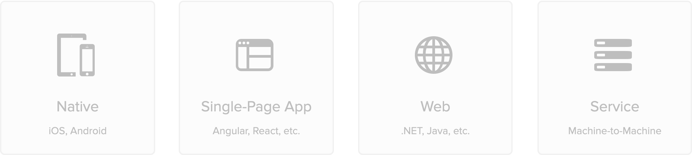

---

---

## Use Okta for Authentication

### What type of app are you building?

<map name="appmap">
  <area shape="rect" coords="0,0,150,150" alt="native" href="./native">
  <area shape="rect" coords="175,0,325,150" alt="spa" href="./spa">
  <area shape="rect" coords="350,0,500,150" alt="web" href="./web">
  <area shape="rect" coords="525,0,675,150" alt="service" href="./service">
</map>