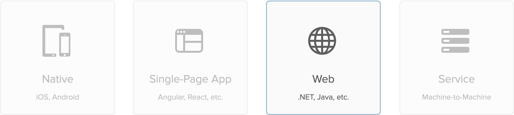

---

---

## Getting Started: Authentication

### What type of app are you building?

<map name="appmap">
  <area shape="rect" coords="0,0,150,150" alt="native" href="./native">
  <area shape="rect" coords="175,0,325,150" alt="spa" href="./spa">
  <area shape="rect" coords="350,0,500,150" alt="web" href="./web">
  <area shape="rect" coords="525,0,675,150" alt="service" href="./service">
</map>

<a href="/code/go/" style="text-decoration: none"><i class="icon docsPage code-go-32"></i>  
              Go
            </a><a href="/code/python/" style="text-decoration: none"><i class="icon docsPage code-python-32"></i>  
              Python
            </a><a href="/code/java/" style="text-decoration: none"><i class="icon docsPage code-java-32"></i>  
              java
            </a><a href="/code/dotnet/aspnetcore/" style="text-decoration: none"><i class="icon docsPage code-dotnet-32"></i>  
              .net
            </a><a href="/code/nodejs/" style="text-decoration: none"><i class="icon docsPage code-nodejs-32"></i>  
              node.js
            </a><a href="/code/php/" style="text-decoration: none"><i class="icon docsPage code-php-32"></i>  
              php
            </a>
